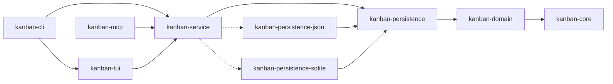

# Contributing to Kanban

Thank you for considering contributing to Kanban! This document provides guidelines and instructions for contributing.

## Development Setup

### Prerequisites

- Rust 1.74+ with cargo
- Nix (recommended for reproducible environment)

### Getting Started

```bash
# Clone the repository
git clone <repo-url>
cd kanban

# Using Nix (recommended)
nix develop

# Or install dependencies manually
rustup update stable
```

### Development Workflow

```bash
# Run the application
cargo run

# Run with import
cargo run -- test-board.json

# Auto-reload on changes
cargo watch -x run

# Fast compile check
cargo check

# Run tests
cargo test

# Linting (with warnings as errors)
cargo clippy --all-targets --all-features -- -D warnings

# Format code
cargo fmt --all
```

## Code Style

### Rust Best Practices

- Follow standard Rust conventions and idioms
- Use `rustfmt` for formatting (enforced in CI)
- Address all `clippy` warnings before submitting PR
- Prefer `&str` over `String` for function parameters
- Use `impl Trait` for return types when appropriate
- Keep functions focused and under 50 lines when possible

### Project-Specific Guidelines

**NO COMMENTS** unless:
- Documenting public APIs
- Explaining complex algorithms
- Required for safety/correctness

**Module Organization:**
- Each file should be < 300 lines
- Extract reusable patterns into separate modules
- Follow existing module structure in `crates/kanban-tui/src/`:
  - `app.rs` - Application state and event handling
  - `ui.rs` - Rendering logic
  - `events.rs` - Event loop and input handling
  - `input.rs` - Input state management
  - `dialog.rs` - Dialog interaction patterns
  - `editor.rs` - External editor integration

**Type Safety:**
- Leverage newtype pattern (`BoardId`, `CardId`, `ColumnId`)
- Use enums for state machines (`AppMode`, `Focus`, `CardFocus`)
- Prefer compile-time guarantees over runtime checks

**Error Handling:**
- All public APIs return `KanbanResult<T>`
- Use `thiserror` for error definitions
- Provide context in error messages
- Log errors with `tracing::error!`

**Immutability:**
- Prefer immutable data structures
- Use `&mut` only when necessary
- Update timestamps on mutation methods

## Architecture Principles

### SOLID Principles

The codebase follows SOLID principles:

1. **Single Responsibility**: Each crate and module has one clear purpose
2. **Open/Closed**: Domain models are extensible through methods
3. **Liskov Substitution**: Types are consistent and predictable
4. **Interface Segregation**: Focused, minimal abstractions
5. **Dependency Inversion**: Layers depend on abstractions

### Workspace Structure

```
crates/
├── kanban-core/               # Core traits, errors, result types
├── kanban-domain/             # Domain models (Board, Card, Column, Sprint)
├── kanban-persistence/        # Persistence traits, registry, and shared types
├── kanban-persistence-json/   # JSON file storage backend
├── kanban-persistence-sqlite/ # SQLite storage backend
├── kanban-service/            # Service layer: KanbanContext, persistence orchestration
├── kanban-tui/                # Terminal UI (ratatui + crossterm)
├── kanban-cli/                # CLI entry point (clap)
└── kanban-mcp/                # Model Context Protocol server for LLM integration
```

**Dependency Flow:**



### Adding a Field to a Domain Model

When adding a new field to any struct in `kanban-domain` (e.g., `Card`, `Board`, `Column`, `Sprint`):

1. Add the field to the struct in `kanban-domain`.

2. **If the field is non-optional** (no `#[serde(default)]`): `row_to_*()` in `kanban-persistence-sqlite/src/sqlite_store.rs` will **fail to compile** because the struct literal is exhaustive — add the column to `schema.sql`, write a migration if the database already exists, and update both `row_to_*()` and the corresponding `upsert_*()` binds.

3. **If the field is optional** (`Option<T>` with `#[serde(default)]`): the SQLite code compiles but silently returns `None` on load — manually update `row_to_*()` and `upsert_*()`, then set the new field to a non-`None` value in `fully_populated_snapshot()` inside both:
   - `crates/kanban-persistence-sqlite/tests/roundtrip.rs`
   - `crates/kanban-persistence-json/tests/roundtrip.rs`

   The roundtrip test (`full_roundtrip_preserves_all_fields`) will fail until all three are updated.

### Adding a New Card-Relation Kind

The card-relation graph is designed to be extensible. To add a fourth
relation kind (e.g. "duplicates", a board-scoped variant, etc.), the
moving parts are:

1. **Define the edge struct** in `kanban-domain/src/dependencies/edges.rs`.
   Embed `EdgeBase` via `#[serde(flatten)]` and add any per-kind metadata
   (severity-like enum, weight, label, …):
   ```rust
   pub struct MyEdge {
       #[serde(flatten)] pub base: EdgeBase,
       pub my_metadata: MyMeta,
   }
   ```
   Implement `Edge for MyEdge` (the trait surface in
   `kanban-core::graph::edge`). `from_endpoints` must construct a default-
   metadata instance so the generic `Graph::add_edge` path works.

2. **Add a sub-graph** to `DependencyGraph` in
   `kanban-domain/src/dependencies/dependency_graph.rs` — pick `DagGraph<MyEdge>`
   (directed, cycle-rejecting) or `UndirectedGraph<MyEdge>` (no direction,
   cycles permitted). Register it in `cascadable_parts_mut()` and
   `edge_sets()` — every cross-cutting cascade (`archive_node`,
   `remove_node`, `len`, `contains`) then picks it up automatically.
   Add per-kind convenience methods (`my_action`, `un_my_action`, listing
   accessors) and a `my_edges()` raw accessor for the persistence layer.

3. **Add per-kind commands** in
   `kanban-domain/src/commands/dependency_commands.rs`:
   - `AddMyKind { source, target, my_metadata: MyMeta }`
   - `RemoveMyKind { source, target, #[serde(default)] tolerate_missing: bool }`
   - Wire them through the `DependencyCommand` enum's `execute` /
     `description` / `capture_inverse` dispatchers.
   - `AddMyKind::capture_inverse` returns a tolerant `RemoveMyKind`;
     `RemoveMyKind::capture_inverse` reads pre-remove metadata.

4. **Add `GraphOperations` trait methods** in
   `kanban-domain/src/graph_operations.rs` for the new kind. Mirror the
   pattern of `block`/`unblock` (single-edge directed) or
   `relate`/`dissociate` (undirected) depending on direction.

5. **Implement the new trait methods** on `KanbanContext` in
   `kanban-service/src/context.rs`, `CliContext`, `McpContext`, `TuiContext`.

6. **Persistence**:
   - **JSON** — add a `my_kind: { edges: [...] }` key to the V6 envelope
     (no migration needed if a field is added cleanly with
     `#[serde(default)]`); otherwise bump to V7 with a transform step in
     `kanban-persistence-json/src/migration/`.
   - **SQLite** — add a `my_kind_edges` table in
     `kanban-persistence-sqlite/src/schema.sql` with appropriate columns
     and CHECK constraints; add read/write paths in `sqlite_store.rs`.

7. **App surfaces** — expose via `kanban relation` subcommands (CLI),
   `tool_*` handlers (MCP), and TUI popup hooks as needed.

8. **Tests** — parameterise existing graph tests over the new kind in
   `kanban-service/tests/card_graph.rs::card_graph_tests!`, and add
   inverse round-trip tests in `inverse_commands.rs`.

### Adding New Features

**Domain First Approach:**

1. **Define Domain Model** in `kanban-domain`
   - Add fields to structs
   - Implement behavior methods
   - Update `updated_at` timestamps

2. **Update Application State** in `kanban-tui/src/app.rs`
   - Add new `AppMode` variants if needed
   - Implement event handlers
   - Add business logic methods

3. **Implement UI** in `kanban-tui/src/ui.rs`
   - Add rendering functions
   - Use existing helpers (`render_input_popup`, `centered_rect`)
   - Follow existing panel/dialog patterns

4. **Wire Up Events** in event handlers
   - Add keyboard shortcuts
   - Update help text in footer
   - Handle dialog interactions

### State Management & Persistence Architecture

The application uses a **command pattern** for all state mutations, enabling progressive auto-save:

**Command Pattern Flow:**
1. **Event Handler** (kanban-tui): Processes keyboard input, collects data
2. **Command** (kanban-domain): Encapsulates the mutation with parameters
3. **KanbanContext** (kanban-service): Executes command via CommandContext
4. **CommandContext**: Applies mutation to data vectors
5. **Save**: KanbanContext writes state to disk via PersistenceStore

**Example Handler Pattern:**
```rust
pub fn handle_create_card_key(&mut self) {
    // Collect immutable data before command execution
    let (board_id, column_id) = { /* ... */ };

    // Create command
    let cmd = Box::new(CreateCard {
        board_id,
        column_id,
        title: self.input.as_str().to_string(),
        // ... other fields
    });

    // Execute (sets dirty flag automatically)
    if let Err(e) = self.execute_command(cmd) {
        tracing::error!("Failed to create card: {}", e);
        return;
    }
}
```

**Persistence Features:**
- **Progressive Auto-Save**: Changes saved immediately after each operation (not just on exit)
- **Async Processing**: Commands queued immediately via bounded channel, processed by background worker
- **Conflict Detection**: Multi-instance changes detected via file metadata (timestamp + size + content hash)
- **Format Versioning**: Automatic V1→V2 migration on load with backup creation
- **Multi-Instance Support**: Last-write-wins resolution for concurrent edits (see [CONFLICT_RESOLUTION.md](CONFLICT_RESOLUTION.md) for data loss scenarios and limitations)
- **Atomic Writes**: Crash-safe write pattern (temp file → atomic rename) prevents corruption
- **Own-Write Detection**: Metadata-based filtering prevents false positives from our own saves

**When Adding Features:**
1. **Define domain command** in `kanban-domain/src/commands/`
2. **Implement Command trait** with execute() and description()
3. **Update handler** in kanban-tui to use `self.execute_command()`
4. **KanbanContext** in kanban-service handles persistence automatically

## Testing

### Running Tests

```bash
# All tests
cargo test

# Specific crate
cargo test --package kanban-domain

# With output
cargo test -- --nocapture
```

### Writing Tests

- Unit tests go in the same file as implementation
- Test domain logic independently
- Use descriptive test names: `test_card_completion_toggle`
- Test edge cases and error conditions

Example:
```rust
#[cfg(test)]
mod tests {
    use super::*;

    #[test]
    fn test_card_completion_toggle() {
        let mut card = Card::new(column_id, "Test".to_string(), 0);
        assert_eq!(card.status, CardStatus::Todo);

        card.update_status(CardStatus::Done);
        assert_eq!(card.status, CardStatus::Done);
    }
}
```

## Branching and Release Workflow

### Branch Strategy

**develop → master** release workflow:

- **Feature branches** → merge to `develop`
- **develop** → accumulates features for next release
- **master** → production releases only

### Development Workflow

1. **Create feature branch** from `develop`:
   ```bash
   git checkout develop
   git pull origin develop
   git checkout -b MVP-123/my-feature
   ```

2. **Make changes** and commit regularly (atomic commits)

3. **Create changeset** before submitting PR:
   ```bash
   # Auto-generate from commits (default: patch)
   ./scripts/create-changeset.sh

   # Or specify bump type and description
   ./scripts/create-changeset.sh minor "Add sprint support"
   ```

4. **Submit PR to develop**:
   - PR will check for changeset presence
   - Changesets accumulate in `develop` (not consumed yet)

5. **Periodic releases** from `develop` → `master`:
   - All accumulated changesets consumed
   - Single version bump (highest precedence wins: patch < minor < major)
   - Automatic publish to crates.io
   - GitHub release created

### Release Cadence

- Features merge to `develop` continuously
- `develop` → `master` releases at the end of the sprint
- One version bump per release, not per feature

### Monorepo Versioning Strategy

**All crates in this workspace maintain synchronized versions:**

- Root `Cargo.toml` defines workspace version via `[workspace.package] version = "X.Y.Z"`
- All crates reference this via `version.workspace = true`
- Cross-crate dependencies use path-only references: `{ path = "../kanban-core" }` (no version)
- This prevents version skew between interdependent crates during publishing

**Why this matters:**

When publishing:
1. `kanban-core` publishes first (no internal dependencies)
2. `kanban-domain` publishes second (depends on kanban-core)
3. `kanban-persistence` publishes third (depends on kanban-domain)
4. `kanban-service` publishes fourth (depends on kanban-persistence)
5. `kanban-tui` and `kanban-mcp` publish fifth (depend on kanban-service)
6. `kanban-cli` publishes last (depends on all others)

If versions diverge between crates, the published versions on crates.io won't resolve dependencies correctly, causing build failures for users.

### Release Validation

Before publishing, the `validate-release.sh` script automatically:

1. Checks all crates use workspace versioning
2. Verifies no hardcoded versions in path dependencies
3. Validates entire workspace builds correctly
4. Runs dry-run publish for each crate
5. Confirms dependency resolution will work when published

**Run locally before release:**
```bash
# Using Nix
nix run .#validate-release

# Or directly
bash scripts/validate-release.sh
```

**Automated in CI:**
- Runs on every PR to `develop` and `master`
- Blocks merge if validation fails
- Ensures no broken releases reach crates.io

## Pull Request Guidelines

### Before Submitting

- [ ] Run `cargo fmt --all` to format code
- [ ] Run `cargo clippy --all-targets --all-features -- -D warnings` and address all warnings
- [ ] Run `cargo test` and ensure all tests pass
- [ ] Test manually with `cargo run`
- [ ] Create changeset with `./scripts/create-changeset.sh`
- [ ] Update README.md if adding user-facing features
- [ ] Update CLAUDE.md if changing architecture/conventions

### PR Title

Use format: `<branch-name>`

### PR Description

Include concise list of changes:

**Example:**
```
Fixes task filtering behavior:

- Add sprint filter toggle to task view
- Update UI to show active sprint indicator
- Fix filter persistence across sessions
```

And include concisely:

- **What**: Brief description of changes
- **Why**: Motivation and context
- **How**: Implementation approach
- **Testing**: How you tested the changes

### Commit Messages

Use semantic commit format:

```
<type>: <description>

[optional body]
```

**Types:**
- `feat`: New feature
- `fix`: Bug fix
- `docs`: Documentation changes
- `refactor`: Code refactoring
- `test`: Adding/updating tests
- `chore`: Maintenance tasks
- `ci`: CI/CD changes

**Examples:**
- `feat: add sprint filtering to task view`
- `fix: handle empty board state correctly`
- `docs: update keyboard shortcuts in README`
- `refactor: extract dialog rendering logic`

**Commit Strategy:**

Make **small, atomic commits** that contain one functionally related change:

✅ **Good - Refactoring:**
```
refactor: add handlers module
refactor: extract navigation handlers
refactor: extract board handlers
refactor: simplify handle_key_event to use handlers
```

✅ **Good - Features:**
```
feat: add sprint domain model
feat: add sprint UI rendering
feat: wire up sprint keyboard shortcuts
```

✅ **Good - Fixes:**
```
fix: validate card title before creation
fix: handle empty board state in renderer
fix: prevent duplicate card IDs on import
```

❌ **Bad:**
```
refactor: extract all handlers and simplify app.rs (giant commit)
feat: add complete sprint feature with UI and tests (too large)
fix: fix bugs (vague, multiple unrelated fixes)
```

**Guidelines:**
- One logical change per commit
- Each commit should compile and pass tests
- Keep commits focused and reviewable
- Group related file additions together
- Separate creation from refactoring

**Quality Criteria - Each commit should be:**
- **Independent**: Can be understood on its own
- **Atomic**: Contains one logical change
- **Descriptive**: Clear commit message following conventional commits format
- **Buildable**: Each commit compiles successfully

The commits should tell a clear story of the feature or refactoring from start to finish.

### Changesets

When submitting a PR, add a changeset file to describe your changes:

1. Create `.changeset/<descriptive-name>.md`:

```md
---
bump: patch
---

Description of changes

- List of changes
```

2. **Bump types**:
   - `patch` - Bug fixes, small changes (0.1.0 → 0.1.1)
   - `minor` - New features, backwards compatible (0.1.0 → 0.2.0)
   - `major` - Breaking changes (0.1.0 → 1.0.0)

3. On merge to master:
   - Version automatically bumps based on changeset
   - CHANGELOG.md updates with your description
   - New version publishes to crates.io
   - GitHub release created with tag

## Code Review Process

1. Automated checks run on all PRs (format, clippy, tests)
2. Maintainer reviews code and provides feedback
3. Address feedback and update PR
4. Once approved, maintainer will merge

## Areas for Contribution

- **Bug Fixes**: Crashes, regressions, and cross-platform fixes (Windows, macOS, Linux) are especially welcome. Small, targeted fixes are easy to review and ship quickly.
- **UI Improvements**: Enhance TUI rendering, add color themes
- **Features**: New metadata fields, filtering, searching
- **Testing**: Increase test coverage, integration tests
- **Documentation**: Improve docs, add examples
- **Performance**: Optimize rendering, reduce allocations
- **Refactoring**: Extract common patterns, improve modularity

## CI/CD and GitHub Secrets

### Required Secrets

To enable automated publishing and releases, configure these secrets in GitHub repository settings:

**CARGO_REGISTRY_TOKEN**
- Required for: Publishing to crates.io
- How to obtain:
  1. Login to crates.io with GitHub account
  2. Go to Account Settings → API Tokens
  3. Create new token with "publish-update" scope
  4. Add to GitHub: Settings → Secrets → Actions → New repository secret

**DEPLOY_KEY**
- Required for: Automated git commits and tag pushes
- How to generate:
  ```bash
  ssh-keygen -t ed25519 -C "github-actions@kanban" -f deploy_key -N ""
  ```
- Add public key (deploy_key.pub) to GitHub: Settings → Deploy keys → Add (with write access)
- Add private key (deploy_key) to GitHub: Settings → Secrets → Actions → New repository secret

### CI/CD Workflows

**ci.yml** - Runs on all pushes and PRs
- Format check (cargo fmt)
- Linter (cargo clippy)
- Tests (cargo test)
- Build validation
- Changeset validation (only on PRs to develop)

**release.yml** - Runs on push to master
- Checks for changesets (skips if none found)
- Bumps version based on changesets
- Updates CHANGELOG.md
- Publishes to crates.io
- Creates GitHub release with tag

### Workflow Architecture

```
Feature Branch → develop (via PR + changeset)
                    ↓
                 (accumulate features)
                    ↓
              develop → master (weekly release PR)
                    ↓
            [CI checks] → [Release workflow]
```

## Questions?

- Open an issue for bugs or feature requests
- Start a discussion for design questions
- Check existing issues for similar topics

## License

By contributing, you agree that your contributions will be licensed under the Apache 2.0 License.

