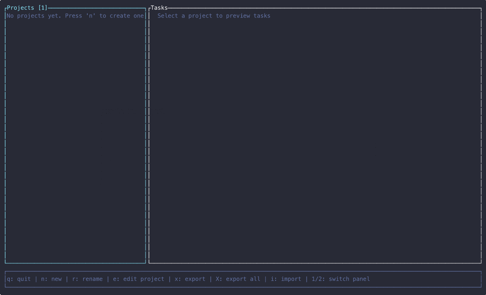

# Kanban

[](https://crates.io/crates/kanban-cli)
[](LICENSE.md)

A **fast, keyboard-driven kanban tool**



**Inspired by**: [lazygit](https://github.com/jesseduffield/lazygit)

**Made possible** by: [ratatui](https://ratatui.rs)

## Features

### 🎯 Core
- **Board Management**: Create, edit, and organize multiple boards
- **Custom Columns**: Define your own columns to match your workflow (e.g., **Todo**, **In Progress**, **Blocked**, **Done**)
- **Rich Cards**: Cards with metadata including priority, story points, due dates, and more
- **Keyboard-Driven**: Vim-like navigation with hjkl and context-aware shortcuts

### 🚀 Productivity
- **Search**: Find cards instantly with vim-style `/` search
- **Multiple Views**: Switch between flat list, grouped by column, or kanban board layout with `V`
- **External Editor**: Edit in your preferred editor (emacs, nano, vim, etc.)

### 📊 Organization
- **Sprint Planning**: Plan, start and complete sprints
- **Story Points**: Assign 1-5 point estimates with color-coded display
- **Filtering**: Filter by sprint, status, or search results
- **Card Archiving**: Archive tasks with restoration support
- **Metadata**: Organize with due dates, priority levels, and timestamps

## Installation

### From crates.io
```bash
cargo install kanban-cli
kanban
```

### From Source
```bash
git clone https://github.com/fulsomenko/kanban
cd kanban
cargo install --path crates/kanban-cli
```

### Using Nix
```bash
nix run github:fulsomenko/kanban
```

## Quick Start

```bash
kanban                 # Launch the app
kanban myboard.json    # Load a board from file
```

**First time?**
1. Press `n` to create a new board
2. Press `Enter` to activate it
3. Add cards with `n` and organize them
4. Press `x` to export as JSON

## Multiple Views

Switch between view modes with `V`:
- **Flat List**: See all cards in a simple list with details
- **Grouped by Column**: Cards organized under their respective columns
- **Kanban Board**: Classic columnar board layout for visual workflow

## Usage

> **Tip:** Press `?` at any time to view the help menu with all available bindings for your current context.

**Navigation**
- `j`/`k` - Up/down, `h`/`l` - Previous/next column
- `Enter` - Open card

**Card list**
- `n` - New card, `e` - Edit, `r` - Rename
- `d` - Archive, `c` - Toggle done, `p` - Set priority

**Views & Search**
- `V` - Toggle view mode, `/` - Search
- `t` - Sprint filter, `D` - Archived cards

**Other**
- `y` - Copy to clipboard, `H`/`L` - Move card left/right, `q` - Quit

## Architecture

Built with **Rust** for speed and reliability:

```
crates/
├── kanban-core        → Shared traits & error handling
├── kanban-domain      → Domain models (Board, Card, Column, Sprint)
├── kanban-persistence → JSON storage, versioning & migrations
├── kanban-tui         → Terminal UI with ratatui
└── kanban-cli         → CLI entry point
```

**Key Design Patterns:**
- **Command Pattern**: All mutations flow through domain commands for persistent tracking
- **Immediate Saving**: Changes auto-save instantly after each action, not just on exit
- **Format Versioning**: Automatic V1→V2 migration with backup on first load
- **Multi-Instance Support**: Last-write-wins conflict resolution for concurrent edits

## Data & Persistence

- **Format**: JSON-based import/export with **immediate auto-save** (saves changes instantly after each action)
- **Automatic Migration**: V1 data files are automatically upgraded to V2 format on load with backup creation
- **Multi-Instance Support**:
  - Real-time file watching detects changes from other running instances
  - Automatic reload when no local changes exist
  - User prompt when local edits conflict with external changes
  - Last-write-wins conflict resolution for concurrent edits
- **Atomic Writes**: Crash-safe write pattern (temp file → atomic rename) prevents data corruption
- **External Editor**: Automatically detects vim, nvim, nano, or your `$EDITOR` for editing descriptions
- **Rich Metadata**: Timestamps, priority levels, story points, custom tags
- **Bounded Save Queue**: Maintains a queue of up to 100 pending snapshots to prevent unbounded memory growth

## Roadmap

- [x] Progressive auto-save (save changes to board as you make them, not just on exit)
- [ ] Card dependencies
- [ ] Configurable keybindings
- [ ] Audit log
- [ ] Multiple storage backends (.md archive, SQL, MongoDB) with pluggable architecture
- [ ] HTTP API for remote board access and programmatic control
- [ ] Full CLI interface matching TUI operations (scriptable kanban commands)
- [ ] Collaborative features (multi-user, sync)

## Contributing

See [CONTRIBUTING.md](CONTRIBUTING.md) for development workflow, code style, and testing guidelines.

## License

Apache 2.0 - See [LICENSE.md](LICENSE.md) for details
