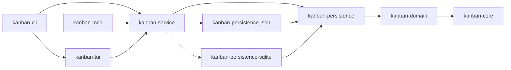

# Kanban

[](https://github.com/fulsomenko/kanban/actions/workflows/ci.yml)
[](https://crates.io/crates/kanban-cli)
[](https://aur.archlinux.org/packages/kanban)
[](https://search.nixos.org/packages?show=kanban&channel=stable-26.05)
[](https://search.nixos.org/packages?show=kanban&channel=unstable)
[](https://github.com/fulsomenko/homebrew-tap)
[](LICENSE.md)

**Keyboard-first kanban for the terminal.**


*Inspired by [lazygit](https://github.com/jesseduffield/lazygit) · Built on [ratatui](https://ratatui.rs)*

---

## Why Kanban?

- **Zero latency** — pure keyboard flow — hjkl, never reach for the mouse
- **Your data is a file on your disk** — private, offline, always yours
- **Git-native** — generate branch names and `git checkout` commands from any card
- **LLM-native** — full MCP server (44 tools) works with Claude Code, Cursor, and any MCP client
- **Offline-first** — works anywhere; JSON and SQLite backends, atomic writes, live conflict detection

---

## Quick Start

### TUI

```bash
kanban                  # launch in-memory; pick or skip a file from the startup dialog
kanban boards.json      # open or create a JSON board file
kanban boards.sqlite    # open or create a SQLite board file
```

Press `?` at any time to see context-sensitive help.

### CLI

```bash
export KANBAN_FILE=boards.json   # or pass the path as the first argument

kanban board create --name "My Project"
kanban board list
kanban card create --board "My Project" --column TODO --title "Fix the bug" --priority high
kanban card list --board "My Project"
kanban sprint create --board "My Project"
kanban sprint activate yarara-release --duration-days 14
kanban card assign-sprint KAN-5 --sprint yarara-release
kanban relation add --parent KAN-5 --child KAN-7   # KAN-7 is now a subtask of KAN-5
kanban relation children KAN-5                     # list direct children of KAN-5
```

### Init (non-interactive setup)

```bash
kanban init boards.json --board "My Project"  # create file + first board, exit
kanban init --board "My Project"              # uses KANBAN_FILE or boards.json
kanban init                                   # creates the file with no entities
```

Every entity argument accepts either a UUID or a human-readable name (sprint
numbers also work for sprints; cards accept their `KAN-N` identifier). When a
name doesn't match, the error lists what's available.

All commands output JSON. Use `kanban --help` for full reference.

### MCP Server

**Claude Code**

```json
{
  "mcpServers": {
    "kanban": {
      "command": "kanban-mcp",
      "args": ["boards.json"]
    }
  }
}
```

---

## Installation

### From crates.io
```bash
cargo install kanban-cli
```

### From source
```bash
git clone https://github.com/fulsomenko/kanban
cd kanban
cargo install --path crates/kanban-cli
```

### Homebrew
```bash
brew install fulsomenko/tap/kanban
```

### Using Nix
```bash
nix run github:fulsomenko/kanban
```

### Arch Linux (AUR)
```bash
yay -S kanban
```

### Linux Clipboard Support

For `y`/`Y` clipboard operations to persist after the app exits, you need a clipboard manager:

- **Wayland**: `wl-clip-persist`, `cliphist`, `clipman`, or your DE's built-in manager
- **X11**: Most desktop environments include one by default

### Windows and WSL

If your setup is Windows and WSL, and you often switch between them, then it is recommended to install separate binaries for each system to avoid constant recompiles.

---

## EDITOR configuration

Changes are made in an external editor as defined by your `EDITOR`. Neovim, nano, or some other terminal-based editor is recommended, both for easier switching between edits and browsing, and because editors that leave the terminal may cause issues.

VS Code is known not to work in the current implementation.

`kanban` is well-tested on supported OSes and is designed to be shell-agnostic. If your `EDITOR` is not set, it will default to `notepad` on Windows and `vi` otherwise.

---

## Features

### Boards & Cards
- Multiple boards, each with custom columns and WIP limits
- Rich cards: title, description, priority (Low/Medium/High/Critical), status (Todo/InProgress/Blocked/Done), story points, due dates
- Card numbering with configurable prefix (e.g. `KAN-42`)
- Card relations: parent/child (Spawns), blocking (with severity), and undirected relates (with sub-kind) — each with cycle / self-reference detection and dedicated `kanban relation` CLI + MCP tools
- Archive and restore cards

### Sprint Planning
- Full sprint lifecycle: Planning → Active → Completed / Cancelled
- Carry uncompleted cards to the next sprint with one key
- Per-sprint card prefix overrides
- Sprint logs track assignment history per card

### Views & Navigation
- **3 view modes**: Flat list / Grouped by column / Kanban board — toggle with `V`
- Real-time `/` search
- Sort by priority, points, status, or position
- Filter by sprint, status, or search result
- Multi-select for bulk archive / move / sprint-assign

### Productivity
- Undo/redo (`u`/`U`, up to 100 levels)
- External editor for descriptions (respects `$EDITOR`)
- Clipboard: `y` copies git branch name, `Y` copies `git checkout` command
- Import/export boards as JSON

### Storage & Sync
- JSON and SQLite storage backends
- Atomic writes (temp file → rename) prevent corruption
- Live file watching: auto-reload when another instance writes
- Conflict detection with user prompt when local edits clash

### Interfaces
- **TUI** — full keyboard-driven terminal UI
- **CLI** — scriptable; all operations, JSON output, pagination
- **MCP server** — 44 tools for LLM integration

---

## Key Bindings

Press `?` in the app to see bindings for the current context.

### Boards Panel

| Key | Action |
|-----|--------|
| `j`/`↓` | Navigate down |
| `k`/`↑` | Navigate up |
| `gg` | Jump to top |
| `G` | Jump to bottom |
| `Enter`/`Space` | Open board detail |
| `n` | New board |
| `r` | Rename board |
| `e` | Edit board |
| `x` | Export board |
| `X` | Export all boards |
| `i` | Import board from file |
| `u` | Undo |
| `U` | Redo |
| `S` | Open settings |
| `1`/`2` | Focus boards/cards panel |
| `q` | Quit |
| `?` | Help |

### Cards Panel

| Key | Action |
|-----|--------|
| `j`/`↓`, `k`/`↑` | Navigate down/up |
| `gg` / `G` | Jump to top/bottom |
| `{` / `}` | Half-page up/down |
| `h`/`l` | Previous/next column |
| `H`/`L` | Move card left/right column |
| `Enter`/`Space` | Open card detail |
| `n` | New card |
| `e` | Edit card |
| `c` | Toggle done |
| `p` | Set priority |
| `d` | Archive card(s) |
| `D` | View archived cards |
| `v` | Toggle card selection |
| `Ctrl+a` | Select all visible cards |
| `Esc` | Clear selection |
| `P` | Set priority (bulk) |
| `a` | Assign to sprint |
| `o` | Sort cards |
| `O` | Toggle sort order |
| `t` | Toggle sprint filter |
| `T` | Filter options |
| `/` | Search |
| `s` | Manage child cards |
| `V` | Toggle view mode |
| `u` / `U` | Undo / Redo |
| `1`/`2` | Focus boards/cards panel |
| `q` | Quit |
| `?` | Help |

### Card Detail View

| Key | Action |
|-----|--------|
| `1`–`5` | Focus Title / Metadata / Description / Parents / Children panel |
| `e` | Edit current panel |
| `r` | Manage parent cards |
| `R` | Manage child cards |
| `y` | Copy git branch name to clipboard |
| `Y` | Copy `git checkout` command to clipboard |
| `a` | Assign to sprint |
| `d` | Delete card |
| `u` / `U` | Undo / Redo |
| `q`/`Esc` | Back |
| `?` | Help |

### Board Detail View

| Key | Action |
|-----|--------|
| `1`–`5` | Focus Name / Description / Settings / Sprints / Columns panel |
| `e` | Edit current panel |
| `p` | Set branch prefix |
| `n` | New sprint (Sprints panel) / New column (Columns panel) |
| `r` | Rename column (Columns panel) |
| `d` | Delete column (Columns panel) |
| `J`/`K` | Reorder column up/down (Columns panel) |
| `j`/`k` | Navigate within panel |
| `Enter`/`Space` | Open sprint detail (Sprints panel) |
| `u` / `U` | Undo / Redo |
| `q`/`Esc` | Back |
| `?` | Help |

### Sprint Detail View

| Key | Action |
|-----|--------|
| `h`/`l` | Switch between uncompleted/completed panels |
| `j`/`k` | Navigate cards |
| `a` | Activate sprint |
| `c` | Complete sprint |
| `p` | Set sprint prefix |
| `C` | Set card prefix override |
| `o`/`O` | Sort / Toggle sort order |
| `v` | Select card(s) |
| `u` / `U` | Undo / Redo |
| `q`/`Esc` | Back |
| `?` | Help |

### Archived Cards View

| Key | Action |
|-----|--------|
| `j`/`k` | Navigate |
| `gg`/`G` | Jump to top/bottom |
| `{`/`}` | Half-page up/down |
| `r` | Restore card(s) |
| `x` | Delete card(s) permanently |
| `v` | Select for bulk operation |
| `V` | Toggle view mode |
| `u` / `U` | Undo / Redo |
| `q`/`Esc` | Back |

---

## Architecture

```
crates/
├── kanban-core               → Shared types, error handling, config, reusable state primitives
├── kanban-domain             → Domain models, business logic, filtering & sorting
├── kanban-persistence        → Persistence trait layer — pure trait definitions, all I/O lives in backend crates
├── kanban-persistence-json   → JSON file storage backend
├── kanban-persistence-sqlite → SQLite storage backend
├── kanban-service            → KanbanContext, persistence orchestration, undo/redo
├── kanban-tui                → Terminal UI with ratatui
├── kanban-cli                → CLI entry point (clap)
└── kanban-mcp                → Model Context Protocol server
```


```mermaid
graph LR
    CLI[kanban-cli] --> TUI[kanban-tui]
    CLI --> SVC[kanban-service]
    MCP[kanban-mcp] --> SVC
    TUI --> SVC
    SVC --> PER[kanban-persistence]
    SVC -.-> JSON[kanban-persistence-json]
    SVC -.-> SQL[kanban-persistence-sqlite]
    JSON --> PER
    SQL --> PER
    PER --> DOM[kanban-domain]
    DOM --> CORE[kanban-core]
```

| Crate | Description | README |
|-------|-------------|--------|
| `kanban-core` | Shared types, config, errors, graph, pagination | [→](crates/kanban-core/README.md) |
| `kanban-domain` | Domain models, business logic | [→](crates/kanban-domain/README.md) |
| `kanban-persistence` | Persistence trait layer | [→](crates/kanban-persistence/README.md) |
| `kanban-persistence-json` | JSON file backend | [→](crates/kanban-persistence-json/README.md) |
| `kanban-persistence-sqlite` | SQLite backend | [→](crates/kanban-persistence-sqlite/README.md) |
| `kanban-service` | Service layer, KanbanContext, undo/redo | [→](crates/kanban-service/README.md) |
| `kanban-tui` | Terminal UI | [→](crates/kanban-tui/README.md) |
| `kanban-cli` | CLI entry point | [→](crates/kanban-cli/README.md) |
| `kanban-mcp` | MCP server | [→](crates/kanban-mcp/README.md) |

---

## Data & Persistence

### JSON Backend (default)

- **V2 envelope format**: `{ "version": 2, "metadata": {...}, "data": {...} }`
- **Atomic writes**: crash-safe — every write is atomic (temp file → rename)
- **Debounced saving**: 500ms minimum interval between saves
- Default for any plain file path

### SQLite Backend

- **WAL mode** with foreign key enforcement
- **Connection pool**: max 2 connections
- **Relational schema**: boards, columns, cards, archived cards, sprints, sprint logs, dependency graph edges, and more
- Schema versioning with migration skeleton for future upgrades
- File selected by `.sqlite`, `.sqlite3`, or `.db` extension

### Multi-Instance Support

- **File watching**: detects changes written by other TUI or MCP instances
- **Auto-reload**: applies external changes automatically when the local state is clean
- **Conflict prompt**: when local edits clash with an external write, you choose to reload or keep

---

## Roadmap

- [x] Progressive auto-save
- [x] Full CLI interface
- [x] Card relations (parent/child, blocks with severity, relates with sub-kind)
- [x] Multiple storage backends (JSON + SQLite)
- [x] MCP server for LLM integration
- [x] Full undo/redo
- [x] Sprint planning lifecycle
- [x] Bulk operations
- [ ] Configurable keybindings
- [ ] Attachments (files on cards)
- [ ] Audit log
- [ ] HTTP API for remote access
- [ ] Collaborative / sync features

---

## Contributing

See [CONTRIBUTING.md](CONTRIBUTING.md) for development workflow, code style, and testing guidelines.

## License

Apache 2.0 — see [LICENSE.md](LICENSE.md)
