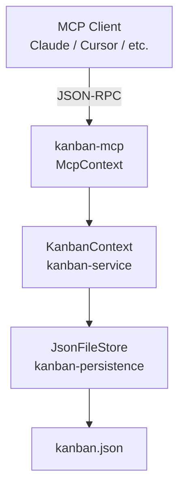

# kanban-mcp

Model Context Protocol (MCP) server for kanban project management.

## Architecture

`kanban-mcp` runs in-process: it holds a `KanbanContext` from `kanban-service` directly in
memory rather than delegating to a subprocess. All MCP tool handlers call into `KanbanContext`
and persist state after every mutating operation.



### Concurrency Model

Every mutating operation follows a **reload-before-mutate** pattern implemented by the
`mutating_op!` macro:

1. `reload()` — re-read state from disk, picking up any external changes
2. Execute the operation against the in-memory state
3. `save()` — atomically write the updated state to disk

Read operations (`read_op!`) use the cached in-memory state. Stale reads are acceptable and
consistent with TUI behaviour — both the TUI and MCP server treat the on-disk file as the
source of truth for writes while tolerating brief staleness on reads.

## Installation

### From Nix (recommended)

```bash
nix build .#kanban-mcp
```

### From Cargo

```bash
cargo install --path crates/kanban-mcp
```

## Usage

```bash
kanban-mcp /path/to/kanban.json
```

### MCP Client Configuration

**Claude Desktop** (`~/Library/Application Support/Claude/claude_desktop_config.json`):

```json
{
  "mcpServers": {
    "kanban": {
      "command": "kanban-mcp",
      "args": ["/path/to/kanban.json"]
    }
  }
}
```

**Claude Code** (`.mcp.json` in project root):

```json
{
  "mcpServers": {
    "kanban": {
      "command": "kanban-mcp",
      "args": ["kanban.json"]
    }
  }
}
```

## Available Tools

| Tool | Description |
|------|-------------|
| `create_board` | Create a new kanban board |
| `list_boards` | List all boards |
| `get_board` | Get a specific board by ID |
| `delete_board` | Delete a board and all its contents |
| `create_column` | Create a new column in a board |
| `list_columns` | List columns in a board |
| `delete_column` | Delete a column and its cards |
| `create_card` | Create a new card in a column |
| `list_cards` | List cards with optional filters |
| `get_card` | Get a specific card by ID |
| `move_card` | Move a card to a different column |
| `update_card` | Update card properties |
| `archive_card` | Archive a card |
| `delete_card` | Permanently delete a card |

## Testing

```bash
# Unit tests
cargo test --package kanban-mcp

# With logging
RUST_LOG=debug cargo test --package kanban-mcp
```
