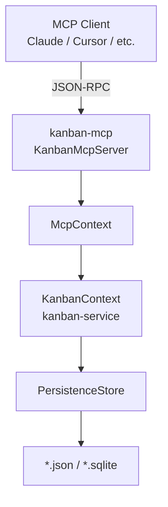

# kanban-mcp

Model Context Protocol (MCP) server for kanban project management. Provides 40 tools covering boards, columns, cards, sprints, bulk operations, import/export, and undo/redo.

## Architecture

`kanban-mcp` runs in-process: it holds a `KanbanContext` from `kanban-service` directly in memory. All tool handlers call into `KanbanContext` and persist state after every mutating operation.



### Concurrency Model

Every mutating operation follows a **reload-before-mutate** pattern:

1. `reload()` — re-read state from disk, picking up any external changes
2. Execute the operation against in-memory state
3. `save()` — atomically write updated state to disk

Read operations use cached in-memory state. Both the TUI and MCP server treat the on-disk file as the source of truth for writes while tolerating brief staleness on reads.

## Installation

### From Nix (recommended)
```bash
nix build .#kanban-mcp
```

### From Cargo
```bash
cargo install --path crates/kanban-mcp
```

## Usage

```bash
kanban-mcp /path/to/boards.json
kanban-mcp /path/to/boards.sqlite
```

## MCP Client Configuration

**Claude Desktop** (`~/Library/Application Support/Claude/claude_desktop_config.json`):
```json
{
  "mcpServers": {
    "kanban": {
      "command": "kanban-mcp",
      "args": ["/path/to/boards.json"]
    }
  }
}
```

**Claude Code** (`.mcp.json` in project root):
```json
{
  "mcpServers": {
    "kanban": {
      "command": "kanban-mcp",
      "args": ["boards.json"]
    }
  }
}
```

---

## Tools Reference

### Boards (5 tools)

| Tool | Description | Required params | Optional params |
|------|-------------|-----------------|-----------------|
| `tool_create_board` | Create a new kanban board | `name: String` | `card_prefix: String` |
| `tool_list_boards` | List all boards | — | — |
| `tool_get_board` | Get a specific board by UUID or name | `board: String` | — |
| `tool_update_board` | Update board properties | `board: String` | `name`, `description`, `sprint_prefix`, `card_prefix` |
| `tool_delete_board` | Delete board and all its columns, cards, sprints | `board: String` | — |

### Columns (6 tools)

| Tool | Description | Required params | Optional params |
|------|-------------|-----------------|-----------------|
| `tool_create_column` | Create a new column in a board | `board: String`, `name: String` | `position: i32` |
| `tool_list_columns` | List all columns in a board | `board: String` | — |
| `tool_get_column` | Get a specific column by UUID or name | `column: String` | — |
| `tool_update_column` | Update column properties | `column: String` | `name`, `position`, `wip_limit: u32`, `clear_wip_limit: bool` |
| `tool_delete_column` | Delete column and all its cards | `column: String` | — |
| `tool_reorder_column` | Move column to a new position | `column: String`, `position: i32` | — |

### Cards (10 tools)

| Tool | Description | Required params | Optional params |
|------|-------------|-----------------|-----------------|
| `tool_create_card` | Create a new card in a column | `board: String`, `column: String`, `title: String` | `description`, `priority` (low/medium/high/critical), `points: u8`, `due_date` (YYYY-MM-DD or RFC 3339) |
| `tool_list_cards` | List cards with filters. Returns `CardSummary` (title, status, priority, points — use tool_get_card for full detail). | — | `board`, `column`, `sprint`, `status`, `page: u32`, `page_size: u32` |
| `tool_get_card` | Get card by UUID or identifier (e.g. `KAN-5`). Returns list if ambiguous. | `card: String` | — |
| `tool_update_card` | Update card properties | `card: String` | `title`, `description`, `priority`, `status` (todo/in_progress/blocked/done), `points: u8`, `due_date`, `clear_due_date: bool` |
| `tool_move_card` | Move card to a different column | `card: String`, `column: String` | `position: i32` |
| `tool_archive_card` | Archive a card (restorable) | `card: String` | — |
| `tool_restore_card` | Restore an archived card | `card: String` | `column: String` |
| `tool_delete_card` | Delete a card permanently | `card: String` | — |
| `tool_list_archived_cards` | Returns ArchivedCardSummary (title, archived_at, original column — use tool_get_card for full detail) | — | `page: u32`, `page_size: u32` |

### Identifiers

- `board`, `column` — UUID or the entity's name.
- `sprint` — UUID, name, or sprint number.
- `card` — UUID or a short identifier like `KAN-5`. If the identifier matches multiple cards, the tool returns the full list for disambiguation.
- `cards` (bulk operations) — array of UUIDs or card identifiers (e.g. `["KAN-1", "KAN-2", "42"]`); all referenced cards must share a board.

### Card–Sprint (2 tools)

| Tool | Description | Required params |
|------|-------------|-----------------|
| `tool_assign_card_to_sprint` | Assign a card to a sprint | `card: String`, `sprint: String` |
| `tool_unassign_card_from_sprint` | Remove card from its sprint | `card: String` |

### Card Utilities (2 tools)

| Tool | Description | Required params |
|------|-------------|-----------------|
| `tool_get_card_branch_name` | Get git branch name for a card | `card: String` |
| `tool_get_card_git_checkout` | Get `git checkout -b <branch>` command | `card: String` |

### Bulk Card Operations (3 tools)

| Tool | Description | Required params |
|------|-------------|-----------------|
| `tool_archive_cards` | Archive multiple cards | `cards: Vec<String>` (UUIDs or identifiers, e.g. `["KAN-1", "KAN-2"]`) |
| `tool_move_cards` | Move multiple cards to a column | `cards: Vec<String>`, `column: String` |
| `tool_assign_cards_to_sprint` | Assign multiple cards to a sprint | `cards: Vec<String>`, `sprint: String` |

### Sprints (8 tools)

| Tool | Description | Required params | Optional params |
|------|-------------|-----------------|-----------------|
| `tool_create_sprint` | Create a new sprint | `board: String` | `name: String`, `prefix: String` |
| `tool_list_sprints` | List sprints for a board | `board: String` | — |
| `tool_get_sprint` | Get a specific sprint by UUID, name, or number | `sprint: String` | — |
| `tool_update_sprint` | Update sprint properties | `sprint: String` | `name`, `prefix`, `card_prefix`, `start_date`, `end_date`, `clear_start_date: bool`, `clear_end_date: bool` |
| `tool_activate_sprint` | Activate a sprint | `sprint: String`, `duration_days: u32` | — |
| `tool_complete_sprint` | Mark sprint as completed | `sprint: String` | — |
| `tool_cancel_sprint` | Cancel a sprint | `sprint: String` | — |
| `tool_delete_sprint` | Delete a sprint | `sprint: String` | — |

### Sprint Carry-over (1 tool)

| Tool | Description | Required params |
|------|-------------|-----------------|
| `tool_carry_over_sprint_cards` | Move uncompleted cards from a completed/cancelled sprint to a planning sprint | `from_sprint: String`, `to_sprint: String` |

### Import / Export (2 tools)

| Tool | Description | Required params | Optional params |
|------|-------------|-----------------|-----------------|
| `tool_export_board` | Export board data as JSON string | — | `board: String` (omit for all boards) |
| `tool_import_board` | Import board from JSON string | `data: String` | — |

### Undo / Redo (2 tools)

| Tool | Description |
|------|-------------|
| `tool_undo` | Undo the last operation |
| `tool_redo` | Redo the last undone operation |

Undo/redo state is maintained in memory across tool calls within a single server session. History is cleared on server restart.

---

## Error Handling

| Error type | MCP error code |
|------------|---------------|
| Domain errors (not found, validation, cycle, bad input) | `INVALID_PARAMS` |
| I/O, serialization, internal errors | `INTERNAL_ERROR` |

Domain errors (not found, validation) map to `INVALID_PARAMS`; all other errors map to `INTERNAL_ERROR`.
