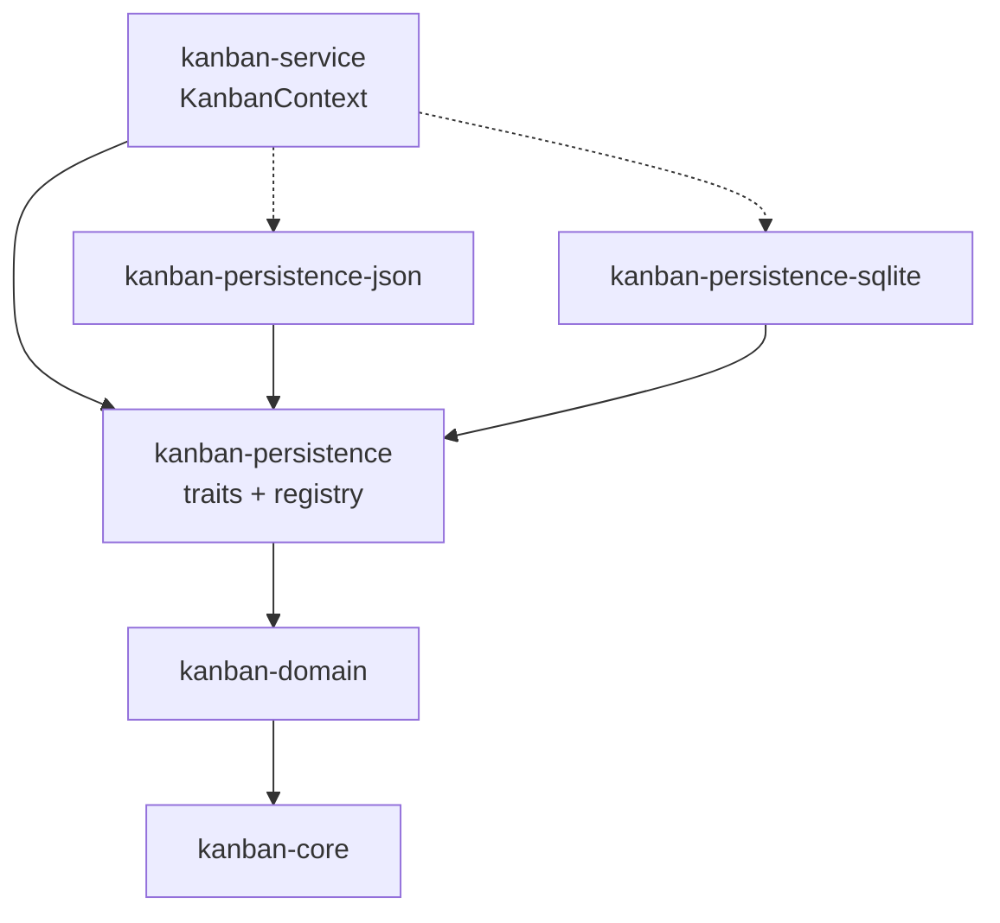

# kanban-persistence

Persistence trait layer for the kanban project management tool. Defines the storage abstractions, factory registry, and shared types used by all storage backends.

## Installation

Add to your `Cargo.toml`:

```toml
[dependencies]
kanban-persistence = { path = "../kanban-persistence" }
```

## Overview

This crate is the **abstraction layer** between `kanban-service` and concrete storage backends (`kanban-persistence-json`, `kanban-persistence-sqlite`). It contains no backend-specific logic — only traits, shared types, and the registry that routes a locator string to the correct backend.

## API Reference

### `PersistenceStore` trait

Core async trait implemented by every storage backend:

```rust
#[async_trait]
pub trait PersistenceStore: Send + Sync {
    async fn save(&self, snapshot: StoreSnapshot) -> PersistenceResult<PersistenceMetadata>;
    async fn load(&self) -> PersistenceResult<(StoreSnapshot, PersistenceMetadata)>;
    fn exists(&self) -> bool;
    fn path(&self) -> &Path;
    fn instance_id(&self) -> Uuid;
}
```

### `StoreFactory` trait

Backend registration interface. Each backend provides a factory that declares which locator patterns it supports:

```rust
pub trait StoreFactory: Send + Sync {
    fn name(&self) -> &str;
    fn supported_patterns(&self) -> &[&str];
    fn matches(&self, locator: &str) -> bool;
    fn create(&self, locator: &str) -> Result<Arc<dyn PersistenceStore>>;
}
```

### `StoreRegistry`

Manages factory registrations and routes locator strings to the matching backend:

```rust
let mut registry = StoreRegistry::new();
registry.register(Box::new(SqliteStoreFactory));
registry.register(Box::new(JsonStoreFactory));

let store = registry.create_store("board.sqlite")?;
```

Factories are tried in registration order. The first factory whose `matches()` returns `true` wins.

### Shared Types

- `StoreSnapshot` — Contains `data: Vec<u8>` and `metadata: PersistenceMetadata`
- `PersistenceMetadata` — Contains `instance_id: Uuid` and `saved_at: DateTime<Utc>`
- `PersistenceEvent` — Events for file watching and change notification
- `FormatVersion`, `MigrationStrategy` — Version detection and migration abstractions
- `ConflictResolver` — Multi-instance conflict resolution

## Architecture



### Command Pattern Flow

1. **Event Handler** collects data and creates Command
2. **Command** is executed via `KanbanContext::execute()`
3. **CommandContext** applies mutation to in-memory vecs
4. **Save**: `KanbanContext::save()` serializes state and calls `PersistenceStore::save()`
5. Backend writes to its storage format (JSON file, SQLite database, etc.)

## Progressive Auto-Save

- **Dirty Flag Tracking**: Changes are marked and queued for persistence
- **Debounced Saving**: Configurable minimum interval between writes to prevent excessive I/O
- **Command Audit Log**: All commands are tracked for audit trails

## Multi-Instance Support

- **Instance IDs**: Each application instance has a unique ID for coordination
- **Last-Write-Wins**: Concurrent modifications resolved by latest timestamp
- **File Watching**: Detects external changes for reload prompts
- **Conflict Resolution**: Pluggable strategies via `ConflictResolver` trait

## Error Handling

All public APIs return `PersistenceResult<T>`:

```rust
match store.load().await {
    Ok((snapshot, metadata)) => { /* handle loaded data */ }
    Err(e) => { /* serialization error, missing file, version error, etc. */ }
}
```

## Available Backends

| Backend | Crate | Patterns | Description |
|---------|-------|----------|-------------|
| JSON | `kanban-persistence-json` | `*.json`, any non-URI path | V2 format, atomic writes, V1 migration |
| SQLite | `kanban-persistence-sqlite` | `*.sqlite`, `*.sqlite3` | WAL mode, relational schema, connection pooling |

## Dependencies

- `kanban-core` — Foundation types and traits
- `kanban-domain` — Domain models
- `serde`, `serde_json` — Serialization
- `tokio` — Async runtime
- `uuid` — ID generation
- `chrono` — Timestamps
- `async-trait` — Async trait support
- `thiserror` — Error handling
- `notify` — File watching

## License

Apache 2.0 — See [LICENSE.md](../../LICENSE.md) for details
