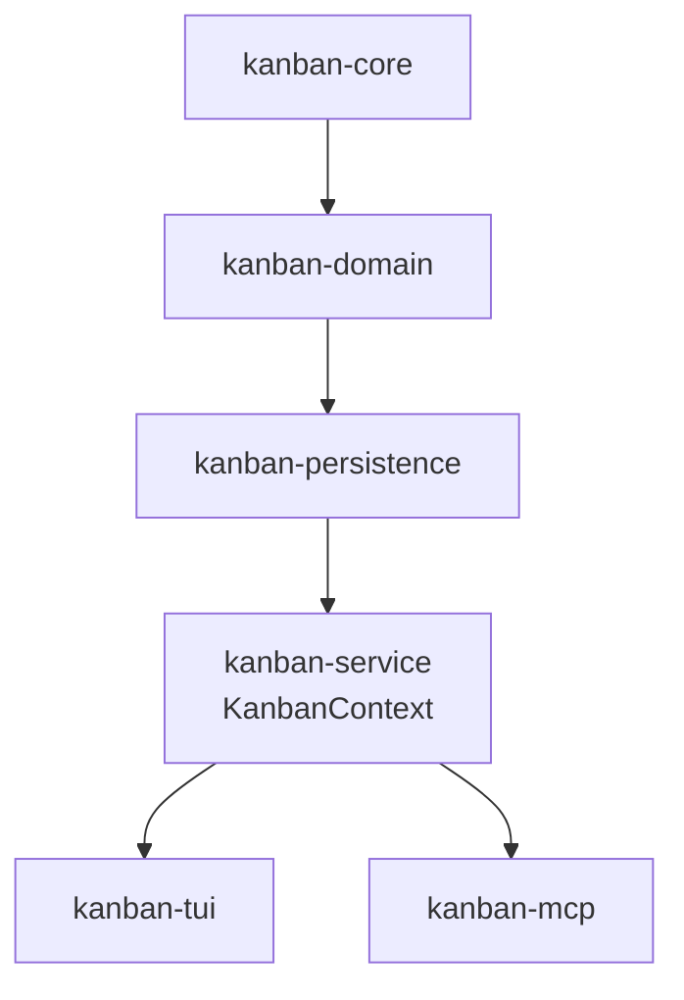

# kanban-persistence

Persistence layer for the kanban project management tool. Handles JSON storage, format versioning, and data migration.

## Installation

Add to your `Cargo.toml`:

```toml
[dependencies]
kanban-persistence = { path = "../kanban-persistence" }
```

## Features

### Progressive Auto-Save

- **Dirty Flag Tracking**: Changes are marked and queued for persistence
- **Debounced Saving**: 500ms minimum interval between disk writes to prevent excessive I/O
- **Atomic Writes**: Temporary file writes with atomic rename for crash safety
- **Command Audit Log**: All commands are tracked for audit trails

### Format Versioning

- **V2 JSON Format**: Structured format with metadata and version tracking
- **Automatic V1→V2 Migration**: Legacy files are transparently upgraded on first load
- **Backup Creation**: V1 files backed up as `.v1.backup` before migration
- **Version Detection**: Automatic format detection without user intervention

### Multi-Instance Support

- **Instance IDs**: Each application instance has a unique ID for coordination
- **Last-Write-Wins**: Concurrent modifications resolved by latest timestamp
- **File Watching**: Detects external changes for reload prompts
- **Conflict Resolution**: Automatic merging strategies for safe concurrent access

## API Reference

### JsonFileStore

Main persistence store implementation:

```rust
use kanban_persistence::{JsonFileStore, PersistenceStore};

// Create store
let store = JsonFileStore::new("board.json");

// Get instance ID
let instance_id = store.instance_id();

// Save data
let snapshot = StoreSnapshot {
    data: serde_json::to_vec(&data)?,
    metadata: PersistenceMetadata::new(instance_id),
};
store.save(snapshot).await?;

// Load data (automatically migrates V1 to V2)
let (snapshot, metadata) = store.load().await?;
```

Persistence is consumed via `kanban-service::KanbanContext`, which owns a `JsonFileStore` and
exposes `load`, `save`, and `reload` as high-level lifecycle methods. Direct use of
`JsonFileStore` is only needed when building custom persistence consumers.

## Architecture



### Command Pattern Flow

1. **Event Handler** collects data and creates Command
2. **Command** is executed via `KanbanContext::execute()`
3. **CommandContext** applies mutation to in-memory vecs
4. **Save**: `KanbanContext::save()` serializes state and calls `JsonFileStore::save()`
5. **Atomic Write** persists to disk with temp file + rename

## Format Specification

### V2 Format

```json
{
  "version": 2,
  "metadata": {
    "instance_id": "uuid-here",
    "saved_at": "2024-01-15T10:30:00Z"
  },
  "data": {
    "boards": [],
    "columns": [],
    "cards": [],
    "sprints": [],
    "archived_cards": []
  }
}
```

### V1 Format (Deprecated)

Legacy format without version field or metadata:

```json
{
  "boards": [],
  "columns": [],
  "cards": [],
  "sprints": []
}
```

Migration automatically adds metadata and wraps data.

## Migration Strategy

### Automatic V1→V2 Migration

1. **Detection**: `Migrator::detect_version()` checks for `version` field
2. **Backup**: Original V1 file copied to `.v1.backup`
3. **Transform**: Data wrapped with V2 metadata
4. **Write**: Migrated file written atomically
5. **Logging**: Migration progress logged for user visibility

### Manual Migration

```rust
use kanban_persistence::migration::{Migrator, FormatVersion};

// Detect current version
let version = Migrator::detect_version("board.json").await?;

// Migrate if needed
if version == FormatVersion::V1 {
    Migrator::migrate(FormatVersion::V1, FormatVersion::V2, "board.json").await?;
}
```

## Performance Characteristics

### Debouncing Benefits

- **Reduced I/O**: Prevents disk thrashing during rapid edits
- **Better Responsiveness**: 500ms debounce balances persistence with UI responsiveness
- **Predictable Load**: Steady-state save frequency ~2 saves/second maximum

### Atomic Write Safety

- **Crash Safety**: Incomplete writes cannot corrupt file
- **Two-Phase Commit**: Write to temp, then atomic rename
- **Recovery**: Interrupted writes leave original file intact

## Examples

### Load, Mutate, Save via KanbanContext

```rust
use kanban_service::KanbanContext;
use kanban_domain::KanbanOperations;

let mut ctx = KanbanContext::load_json("board.json").await?;

let board = ctx.create_board("My Project".into(), None)?;
ctx.save().await?;

// Pick up changes written by another process
ctx.reload().await?;
```

### Handling Concurrent Modifications

```rust
// When file is modified externally (multi-instance editing)
// KanbanContext::reload() re-reads state from disk
// mutating_op! in kanban-mcp calls reload() before every write
// Last-write-wins strategy automatically applied
```

## Error Handling

All public APIs return `KanbanResult<T>`:

```rust
use kanban_persistence::JsonFileStore;

match store.load().await {
    Ok((snapshot, metadata)) => {
        // Handle loaded data
    }
    Err(e) => {
        // Could be serialization error, missing file, or version error
        eprintln!("Failed to load: {}", e);
    }
}
```

## Dependencies

- `kanban-core` - Foundation types and traits
- `kanban-domain` - Domain models
- `serde`, `serde_json` - Serialization
- `tokio` - Async runtime
- `uuid` - ID generation
- `chrono` - Timestamps
- `async-trait` - Async trait support
- `thiserror` - Error handling
- `notify` - File watching

## License

Apache 2.0 - See [LICENSE.md](../../LICENSE.md) for details
