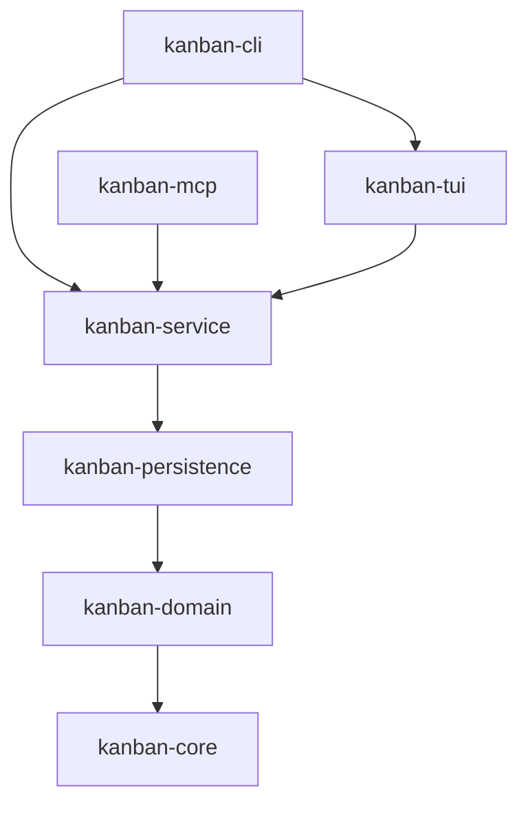
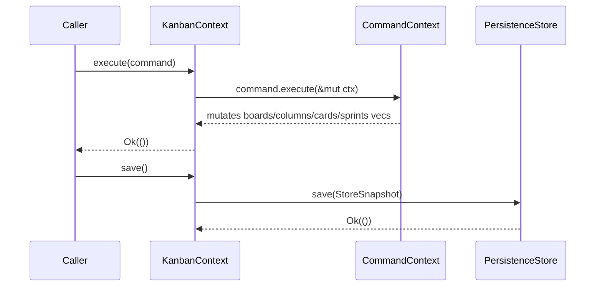

# kanban-service

Service layer for the kanban tool. Bridges domain commands with persistence.

## Installation

Add to your `Cargo.toml`:

```toml
[dependencies]
kanban-service = { path = "../kanban-service" }
```

## Overview

`KanbanContext` is the central runtime object that owns all in-memory board state. It implements
`KanbanOperations` from `kanban-domain`, providing the full set of board, column, card, sprint,
and bulk operations. Internally it wraps a `PersistenceStore` to load, save, and reload state
from disk.

## Usage

```rust
use kanban_service::KanbanContext;
use kanban_domain::KanbanOperations;

let mut ctx = KanbanContext::load_json("board.json").await?;
let board = ctx.create_board("My Board".into(), None)?;
ctx.save().await?;

// Pick up changes written by another process
ctx.reload().await?;
```

## API Reference

### `KanbanContext`

The central runtime object. Holds all board state in memory and delegates persistence to a
`PersistenceStore`.

**Lifecycle methods:**

| Method | Description |
|--------|-------------|
| `KanbanContext::load(store)` | Load from a `PersistenceStore` instance |
| `KanbanContext::load_json(path)` | Convenience: create a `JsonFileStore` and load |
| `ctx.reload()` | Re-read state from disk, discarding in-memory state |
| `ctx.save()` | Serialize current state and write to the store |
| `ctx.execute(command)` | Execute any `Command` against the in-memory state |

**`KanbanOperations` impl** (boards, columns, cards, sprints, import/export):

Boards: `create_board`, `list_boards`, `get_board`, `update_board`, `delete_board`

Columns: `create_column`, `list_columns`, `get_column`, `update_column`, `delete_column`,
`reorder_column`

Cards: `create_card`, `list_cards`, `get_card`, `find_card_by_identifier`, `update_card`,
`move_card`, `archive_card`, `restore_card`, `delete_card`, `list_archived_cards`,
`get_card_branch_name`, `get_card_git_checkout`

Sprints: `create_sprint`, `list_sprints`, `get_sprint`, `update_sprint`, `activate_sprint`,
`complete_sprint`, `cancel_sprint`, `delete_sprint`, `assign_card_to_sprint`,
`unassign_card_from_sprint`

Bulk: `bulk_archive_cards`, `bulk_move_cards`, `bulk_assign_sprint`

Import/Export: `export_board`, `import_board`

### `DataSnapshot`

Serialisable struct written to disk. Contains the full board state:

```rust
pub struct DataSnapshot {
    pub boards: Vec<Board>,
    pub columns: Vec<Column>,
    pub cards: Vec<Card>,
    pub archived_cards: Vec<ArchivedCard>,
    pub sprints: Vec<Sprint>,
    pub graph: DependencyGraph,
}
```

### `BulkOperationResult` / `BulkOperationFailure`

Returned by the three `_detailed` bulk operations. Reports per-item success/failure rather than
just a count:

```rust
pub struct BulkOperationResult {
    pub succeeded: Vec<Uuid>,
    pub failed: Vec<BulkOperationFailure>,
}

pub struct BulkOperationFailure {
    pub id: Uuid,
    pub error: String,
}
```

## Architecture



### Command Pattern Flow



## Bulk Operations

The `_detailed` variants return per-item results instead of a success count, which is useful
when callers need to report partial failures:

| Method | Returns |
|--------|---------|
| `bulk_archive_cards_detailed(ids)` | `BulkOperationResult` |
| `bulk_move_cards_detailed(ids, column_id)` | `BulkOperationResult` |
| `bulk_assign_sprint_detailed(ids, sprint_id)` | `BulkOperationResult` |

## Dependencies

- `kanban-core` — Foundation types and error handling
- `kanban-domain` — Domain models and `KanbanOperations` trait
- `kanban-persistence` — `JsonFileStore` and `PersistenceStore` trait
- `serde`, `serde_json` — Serialization
- `tokio` — Async runtime
- `uuid` — ID generation

## License

Apache 2.0 — See [LICENSE.md](../../LICENSE.md) for details
